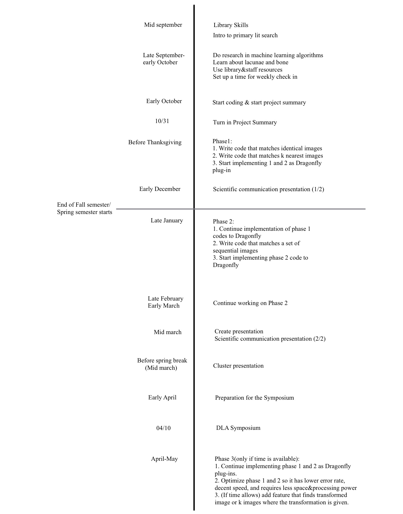

# DLA2019
Name: Ashley Kim
Email: ashleykim0506@gmail.com
Supervisor: Virginia Ferguson

## Problem Statement and Research Objective

The study of osteocytes, bone cells residing within a lacuna or a hollow space within the bone, has long been oppressed. In his paper published in 1977, Partfitt argued that the role of osteocytes is minimal compared to other bone cells (i.e. osteoblasts and osteoclasts) [1]. 
However, more recently, osteocytes have been called the “master orchestrator” for its ability to regulate bone formation (via osteoblasts or bone building cells) and resorption (via osteoclasts or bone removing cells)[4]. Furthermore, the orthopaedic community is discovering the roles of osteocytes in mineral homeostasis such as inflammatory bone loss[2], lactation[3], hibernation[3] and spaceflight[5]. For instance, during lactation, osteocyte lacunae enlarge to allow for extra calcium to be released to the bloodstream [3]. Following lactation, osteocytes replace the bone around their cell body changing the shape and size of lacune. Therefore, by studying the morphological changes in the osteocyte lacune we can gain insight into the osteocyte relationship with the bone around it. Due to the osteocyte’s ability to regulate and facilitate changes to bone, they are an exciting therapeutic target for osteoporosis and other bone diseases. 
Despite the critical role osteocytes play, the current technology that supports the study of osteocytes mediated bone changes is severely limited. While histological analysis can demonstrate biological functions of osteocytes, they are limited to 2D and are unable to visualize changes to the perilacunar bone. Alternatively micro CT and X-ray microscopy(XRM) are able to visualize osteocyte lacunae but are unable to detect individual cell vitality (i.e. if a lacune has a living cell or apoptotic cell). Therefore, the field needs a way to combine the 2D histological images to 3D morphological analysis. The process is currently done in two separate bones which is highly time consuming, often prone to human error, and subject to anatomical bias; it is critical to site-match histological analysis with 3D morphological assessments. 
In the course of this year, I will develop the preliminary basis for novel tool to accomplish the goal of integrating 2D and 3D data. The first step will be to create a novel python program that utilizes images from 2D and 3D images from XRM. The program will do the following:
1. Matches a images to the exact image (exact match).
2. Matches k most similar images to an image (k-nearest match).
3. Finds a set of m sequential images where the order and content of the images are exactly the same (sequential exact match)
4. Finds k sets of m sequential images where the order and content of the images are the closest (sequential k-nearest match)
5. (only if time allows) Matches n images to the transformed images while the details of the transformation is given. 
The scripts will be implemented as a Dragonfly plug-in so it can be used by the community.

## Technical Background

I have always been interested in machine learning and artificial intelligence algorithms. Last semester, I took AI and discovered that I was interested in AI. I am continuing my passion in Machine Learning by being involved in several ML projects and course this semester. In Senior Capstone course, I am leading a team where they are reducing disposables of Trima, an automated blood collection device, by detecting features that give a higher than average alarm rate using applying machine learning algorithms.

## Methodology

A prototype of the program trained with training sets will be initially created using the K-Nearest Neighbor technique. KNN is widely used for image recognition. As the grayscale values of TIFF images can be easily turned list of numerical values using python libraries, KNN algorithm using euclidean distance as the measurement. Since the time and space complexity of naive KNN is O(nd), where n is the number of samples in the training set and d is the dimensionality of the features, as n grows, the software may be computationally expensive. To prevent the problem, pre-processing of the data, such as sorting, or converting the dataset into a more computationally efficient data structure, such as tree, may be applied. 

## Facilities, equipment or other requirement
1. As Dragonfly software requires high spec desktop, a desktop that can support Dragonfly needs to be provided.
2. Advice from the faculty in the computer science department.
3. Access to academic papers such as PubMed.
4. Use of python libraries such as numpy, scikit-learn, and matplotlib

## Citation
[1] Cristal S. Yee, Charles A. Schurman, Carter R. White, and Tamara Alliston. 2019. Investigating Osteocytic Perilacunar/Canalicular Remodeling. Current Osteoporosis Reports 17, 4 (2019), 157–168. DOI:http://dx.doi.org/10.1007/s11914-019-00514-0

[2] Corinne E. Metzger and S.Anand Narayanan. 2019. The Role of Osteocytes in Inflammatory Bone Loss. Frontiers in Endocrinology 10 (2019). DOI:http://dx.doi.org/10.3389/fendo.2019.00285

[3] Wysolmerski, J. J. (2013). Osteocytes remove and replace perilacunar mineral during reproductive cycles. Bone, 54(2), 230–236. doi: 10.1016/j.bone.2013.01.025
[4] Schaffler, M. B., Cheung, W.-Y., Majeska, R., & Kennedy, O. (2013). Osteocytes: Master Orchestrators of Bone. Calcified Tissue International, 94(1), 5–24. doi: 10.1007/s00223-013-9790-y

[5] Gerbaix, M., Gnyubkin, V., Farlay, D., Olivier, C., Ammann, P., Courbon, G., … Vico, L. (2017). Erratum: One-month spaceflight compromises the bone microstructure, tissue-level mechanical properties, osteocyte survival and lacunae volume in mature mice skeletons. Scientific Reports, 7(1). doi: 10.1038/s41598-017-09608-0

## Timeline

